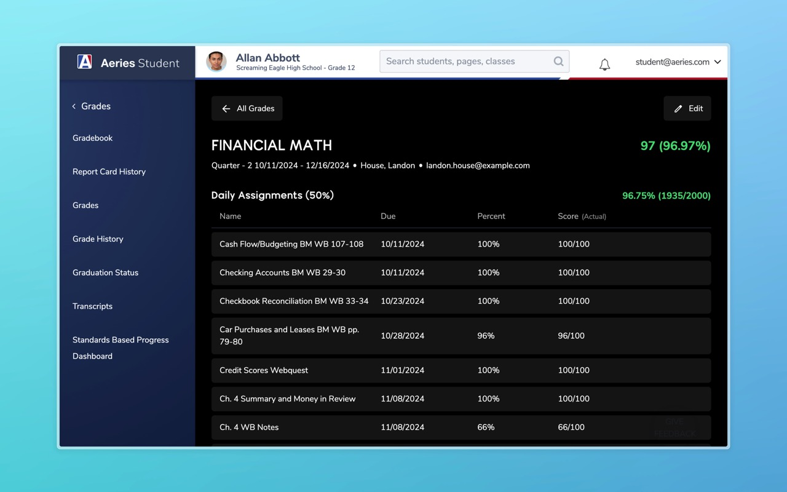
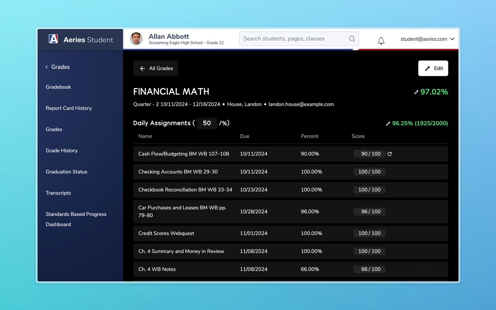
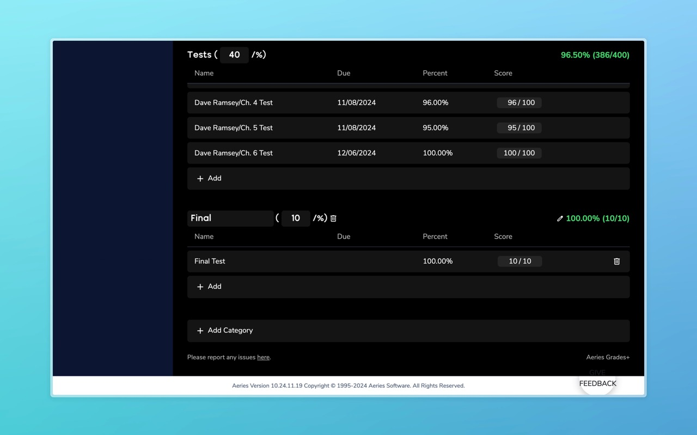

import { Card, CardGrid, LinkCard } from '@astrojs/starlight/components';

## Installation

<LinkCard
    title="Chrome"
    description="Install from Chrome Web Store"
    href="https://chromewebstore.google.com/detail/aeries-grades+/edeaoofdafgcngkmimhfmhflcinfngap?hl=en-US"
/>
<LinkCard
    title="Firefox"
    description="Install from ahsengineering.org"
    href="/extension/380ec7e640a64709874c-0.2.2.xpi"
/>

## About

An improved interface for viewing your grades on Aeries! See all your assignments organized, predict your grades, and adjust/add fake categories and assignments.

You can use this extension just like you already do to view your grades on Aeries. This extension will insert the improved grade viewer on applicable pages. An additional edit button on the top right is added so you can predict your grades!

You can edit your grades to predict what your score will be:

You can also add fake assignments and categories:

Source code: https://github.com/EpicPizza/AeriesGrades

Please send any questions, feedback, or issues on this [form](https://docs.google.com/forms/d/e/1FAIpQLScMri2JCO1lXSXup-gbzKg-5OaOeiDh8e_R09Zh0EU8z7J8qg/viewform).