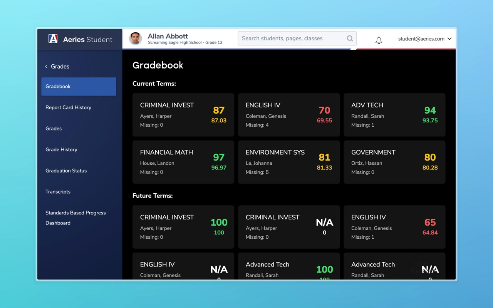

import { Card, CardGrid, LinkCard } from '@astrojs/starlight/components';

## Installation

<LinkCard
    title="Chrome"
    description="Install from Chrome Web Store"
    href="https://chromewebstore.google.com/detail/aeries-grades+/edeaoofdafgcngkmimhfmhflcinfngap?hl=en-US"
/>
<LinkCard
    title="Firefox"
    description="Install from ahsengineering.org"
    href="/extension/380ec7e640a64709874c-0.4.1.xpi"
/>

## About

An improved interface for viewing your grades on Aeries! See all your assignments organized, predict your grades, and adjust/add fake categories and assignments.

You can use this extension just like you already do to view your grades on Aeries. This extension will insert the improved grade viewer on applicable pages. An additional edit button on the top right is added so you can predict your grades!

Features

- Assignments are organized into their respective categories.
- Scores and categories can be edited. Fake assignments and categories can also be added.
- Detects if a category is the final for that class and calculates what you need to get an A (or any other grade).
- Never get kicked back to the first class when refreshing the page.

<LinkCard
    title="Source Code"
    href="https://github.com/EpicPizza/AeriesGrades"
/>
<LinkCard
    title="Privacy Policy"
    href="/aeries/privacy-policy"
/>
<LinkCard
    title="Questions, Feedback, or Issues"
    href="https://docs.google.com/forms/d/e/1FAIpQLScMri2JCO1lXSXup-gbzKg-5OaOeiDh8e_R09Zh0EU8z7J8qg/viewform"
/>